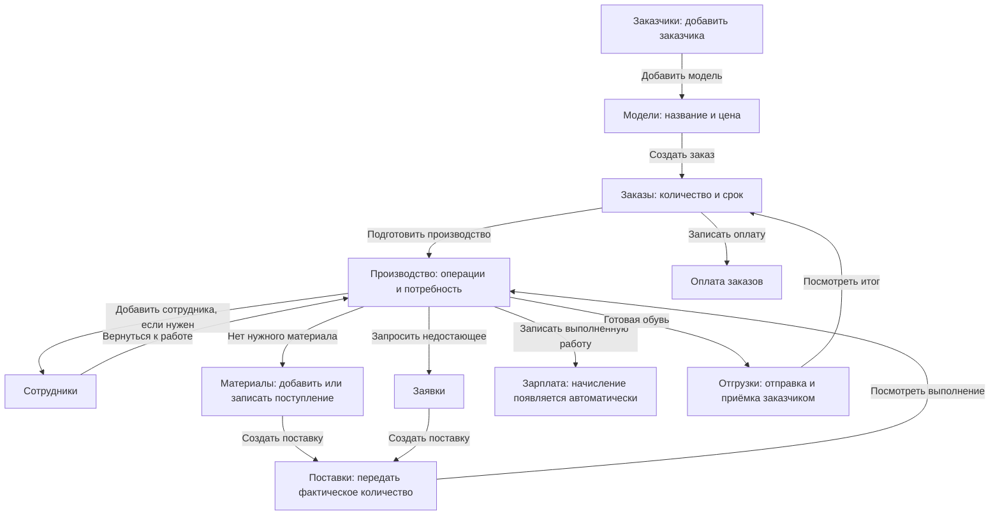

# Простая карта разделов и действий

Дата: 27 сентября 2026 года. Изучена действующая версия 0.63.

**Статус: план следующей переделки. Приложение по этому документу ещё не изменено.**

Задача: человек должен понимать систему по названиям меню и кнопок. Каждый раздел ведёт свои записи. Если для действия нужна другая запись, система переводит в соответствующий раздел, передавая уже выбранные данные.

## 1. Главный принцип

> Заказчика создаём в «Заказчиках». Модель — в «Моделях». Заказ — в «Заказах». Работу выполняем в «Производстве». Материал добавляем в «Материалах». Сотрудника — в «Сотрудниках». Деньги сотруднику записываем в «Зарплате».

Это правило касается создания и изменения данных. Посмотреть название связанной записи, её количество или итог можно в любом нужном месте. Кнопка «Добавить модель» в карточке заказчика допустима: она открывает раздел «Модели», а не форму модели внутри заказчика.

Раздел не означает единственную операцию «создать». В нём можно просматривать, создавать, исправлять, удалять неиспользуемые записи и архивировать записи с историей **его собственного типа**.

Меню не появляется заново после каждого шага. Пункты доступны сразу; при переходе меняется выделенный пункт. Человек запоминает постоянные места действий.

## 2. Что сейчас есть и почему человек путается

Проверены исходники и соответствие рабочей копии на сервере версии 0.63. Предыдущая карта `PRODUCTION_PAYROLL_MAP.md` описывает предметную область; её перечень «что уже есть» относится к старому состоянию и не использован как описание текущего приложения.

| Сейчас | Проблема | Решение в новой карте |
|---|---|---|
| В меню директора есть «Заказчики», «Заказы», «Производство», «Зарплата»; остальные действия в «Ещё» | У моделей нет своего места | Добавить отдельный пункт «Модели» |
| В карточке заказчика создаются и редактируются модели, цены и фото | Карточка заказчика выполняет работу нескольких разделов | Оставить сведения о заказчике и переходы к его моделям и заказам |
| В форме заказа можно создать заказчика и модель | Одно действие незаметно создаёт несколько разных записей | В форме только выбор; создание — переход в нужный раздел с возвращением |
| В партии можно создать первого сотрудника, материал и материал заказчика | Трудно понять, где потом исправлять созданное | Новые сотрудники, материалы и заказчики создаются только в своих разделах |
| Навыки сотрудника находятся в карточке зарплаты | «Зарплата» меняет сведения о сотруднике | Перенести навыки в «Сотрудников» |
| Получение денег от заказчика находится внутри заказа | В одном разделе смешиваются договорённость и движение денег | Отдельный раздел «Оплата заказов»; в заказе только итог и переход |
| Выдача материалов есть в материальном складе, партии и форме поставки | Одно физическое действие можно записать разными способами | Единственная пользовательская форма отправки — «Поставки» |
| В «Заявках» смешаны заявки, поставки и прежние документы передач | Непонятно, что является просьбой, а что фактом отправки | Разделить список заявок и список поставок |
| Для старых передач есть отдельная «Приёмка» | Получение приходится искать отдельно от отправленного документа | Принимать передачу в карточке этой передачи, в «Поставках» |
| В партии находятся выпуск, отгрузка заказчику и завершение | Производство и отправка заказчику смешаны | Выпуск — «Производство», внешняя отгрузка и приёмка заказчиком — «Отгрузки» |
| В старых «Справочниках» вместе заказчики, модели, работники | Сохраняется второе место редактирования тех же записей | Старый общий экран заменить переходами в соответствующие разделы |
| Новая карточка заказчика не имеет удаления или архива | Пользователь не может убрать ошибочную запись | Добавить понятные действия удаления и архива в карточку заказчика |

### Удаление заказчика сейчас

В `catalog.py` для заказчика есть создание и изменение, но нет маршрута удаления или архивирования. В `templates/business/customer.html` соответствующей кнопки тоже нет.

Старый `app.py:ref_arch` умеет выставлять `customers.archived=1`; это **архив, не удаление**. Кнопка находится в старых «Справочниках», на которые новое меню директора не ведёт напрямую. Поэтому претензия к новой карточке обоснованна.

Заказчик может быть связан не только с заказами: также с моделями, старыми документами, заявками, поставками и материалами заказчика. Проверки одного отсутствия заказов для удаления недостаточно.

## 3. Новое меню

### 3.1. Директор

Семь постоянных основных пунктов, в этом порядке:

| Пункт | Объяснение одним предложением |
|---|---|
| **Заказчики** | Кто заказывает у нас обувь |
| **Модели** | Какую обувь заказывает каждый заказчик и какая у неё обычная цена |
| **Заказы** | Что заказали сейчас: модели, количество, цена и срок |
| **Производство** | Какие работы нужны по заказу и сколько уже выполнено |
| **Материалы** | Что за материалы, что поступило и сколько осталось |
| **Сотрудники** | Кто работает и какие операции умеет выполнять |
| **Зарплата** | Сколько заработали сотрудники и сколько им выдали |

«Ещё» открывает самостоятельные разделы, которые нужны реже директору:

- **Заявки** — просьбы производства о недостающем.
- **Поставки** — реальные передачи между складом и производством.
- **Отгрузки** — отправка обуви заказчику и его приёмка.
- **Оплата заказов** — фактически полученные деньги от заказчиков.

«Ещё» — способ размещения пунктов, не отдельный рабочий раздел. При открытии вложенной страницы её название видно в меню и в заголовке. Не заводить дополнительный общий «Обзор», «Мастер», «Справочники» или «Настройки заказа».

На компьютере основные пункты видны в боковом меню. На телефоне внизу: «Заказчики», «Модели», «Заказы», «Производство», «Ещё». Остальные разделы доступны из «Ещё». Активный раздел из этого списка показывается названием в раскрытом меню; телефон не должен постоянно менять состав нижних кнопок.

### 3.2. Склад

Основные пункты: **Заявки → Поставки → Материалы → Производство**. В «Ещё»: Заказчики, Модели, Заказы, Сотрудники, Зарплата, Отгрузки, Оплата заказов — в рамках текущих разрешений склада.

Нельзя ради этой переделки незаметно убрать полномочия склада, который по текущей договорённости частично выполняет работу директора. Названия, собственные формы разделов и маршруты переходов одинаковы в обеих ролях.

Начальная страница склада остаётся «Заявки».

### 3.3. Производство

Основные пункты: **Производство → Заявки → Поставки**. «Поставки» содержит входящие передачи и передачу готовой обуви обратно на склад. Входящие документы, требующие получения, показываются первыми.

Производство не получает доступ к цене заказчика, прибыли, созданию заказчиков или выплатам. Для этих действий у него нет активных кнопок. Если сотрудников добавляет директор/склад, при пустом списке показано «Попросите директора добавить сотрудника»; не давать ссылку, заканчивающуюся ошибкой доступа.

Начальная страница производства — «Производство».

## 4. Вся последовательность на одной схеме

Стрелка означает переход в другой пункт меню. Она не означает, что форма другого раздела встроена в исходную страницу. Стрелка к зарплате показывает автоматический результат записи работы: производство не заполняет отдельную форму начисления.

Сотрудников и материалы можно добавить до первого заказа или позже. Они не обязательные ступени знакомства с системой.

## 5. Единое устройство каждого раздела

1. Заголовок совпадает с названием в меню.
2. Есть список настоящих записей и одна главная кнопка создания.
3. Если записей нет, показывается одна короткая фраза и подходящая кнопка. Не создавать пустую таблицу, карточку, строку или блок с нулём.
4. Нажатие на запись открывает её сведения. Само открытие ничего не сохраняет и не меняет статус.
5. В карточке сверху — данные записи и главное доступное действие. Редкие действия — ниже, в «Дополнительно».
6. Создание и редактирование собственной записи используют одну понятную форму. Не добавлять промежуточные страницы выбора режима, подтверждения сохранения или общего обзора.
7. После сохранения человек остаётся в разделе созданной записи. Появляется короткое сообщение и кнопка следующего осмысленного перехода.
8. Кнопки переходов называют действие: «Добавить модель», «Создать заказ», «Подготовить производство». Не использовать «Далее», «Продолжить», «Обработать» без предмета действия.
9. Реальное сохранение выполняется кнопкой «Сохранить …», отправка — «Отправить …», запись денег — «Записать …».
10. Архив принадлежит своему разделу. Ссылка «Архив» появляется только при наличии архивных записей. Отдельного общего раздела архивов не нужно.

Связанные записи можно показать компактной строкой-ссылкой: «Модели этого заказчика · 2». Под этой строкой не размещать чужую форму, редактор или полноценный второй рабочий список.

## 6. Заказчики

### Свои данные и действия

Данные: название; необязательные контакт и примечание. Действия: добавить, посмотреть, изменить, удалить неиспользуемого, убрать в архив, восстановить.

Список: название, контакт при наличии, кнопка/переход открытия. Не показывать цену моделей, редактирование моделей, операции или зарплату.

Карточка: название и сведения; «Изменить»; переходы «Модели заказчика», «Добавить модель», «Заказы заказчика». Главный переход после первого сохранения — **«Добавить модель»**.

### Точный путь

`Заказчики → Добавить заказчика → Название → Сохранить заказчика`.

После сохранения:

- человек остаётся в «Заказчиках»;
- видит «Заказчик добавлен»;
- нажимает «Добавить модель»;
- открывается **«Модели → Новая модель»**, заказчик уже выбран;
- в меню выделяется «Модели».

### Удаление и архивирование

Расположение: карточка заказчика → «Дополнительно». Система сама выбирает доступные действия, не заставляя пользователя разбираться в связях таблиц.

| Ситуация | Доступное действие | Результат |
|---|---|---|
| Нет моделей и использования в документах | «Удалить заказчика» | Ошибочная запись удаляется |
| Есть только неиспользуемые модели, нет рабочих документов | «Удалить заказчика» | Одно подтверждение сообщает точное количество моделей; заказчик и эти модели удаляются вместе |
| Заказчик или его модели использовались в заказах, заявках, передачах, остатках или движениях | «Убрать в архив» | Пропадает из нового выбора, история и текущие обязательства сохраняются |
| Заказчик уже в архиве | «Восстановить заказчика» | Снова доступен для новых действий |

Перед настоящим удалением — одно короткое подтверждение: «Удалить заказчика “Север”?» либо «Удалить заказчика “Север” и его 2 неиспользуемые модели?». Никаких каскадных дополнительных подтверждений.

Для используемого заказчика пояснение рядом с архивированием: «История сохранится». Не называть архив «удалением».

Архивирование не отменяет заказы, не списывает материалы и не закрывает расчёты. Если есть работа или задолженность, в подтверждении архивирования прямо написать: «Заказчик исчезнет из выбора для новых заказов. Текущая работа и расчёты продолжатся». Это единственный дополнительный вопрос для такого случая.

В новых формах модели архивного заказчика недоступны. В существующих заказах они доступны для выполнения, отгрузки и расчётов. Это потребует разделить проверки «разрешено создать новое» и «разрешено закончить существующее».

При архивировании заказчика не менять отдельный флаг архива каждой модели. Их доступность определяется также состоянием заказчика. После восстановления доступны только модели, которые до этого сами не были архивированы.

Фактическое использование включает старые документы, `orders`, `production_batches`, `request_items`, `shipment_items`, владельца материальных остатков/движений и использование моделей в выработке. Проверка выполняется внутри транзакции непосредственно перед удалением. Нельзя проверять только число заказов.

История цен и собственные настройки неиспользуемой модели — служебные данные каталога: они могут удаляться вместе с ней. Рабочие и финансовые документы не удаляются. Действие записывается в журнал с названиями удалённых записей.

## 7. Модели

### Назначение

Одна модель принадлежит одному заказчику. «714» у разных заказчиков — разные модели. В каталоге не создаём производственную партию и не указываем объём конкретного заказа.

Минимальная форма:

1. Заказчик — выбран заранее при переходе из его карточки.
2. Название или артикул модели.
3. Обычная цена заказчика за пару — необязательно, если ещё не согласована.

Фото и описание — свернутый необязательный блок.

Цена за всю партию с известным количеством задаётся в **заказе**, потому что относится к конкретному объёму. В модели хранится обычная цена за пару для подстановки.

Список: модель, заказчик, согласованная цена при наличии. Фильтр по заказчику; при переходе из заказчика фильтр уже установлен. Не писать «0 ₽», если цена неизвестна.

Карточка: сведения модели; «Изменить модель»; **«Создать заказ»**; «Заказы на эту модель» как переход в отфильтрованные «Заказы». История цен — в «Дополнительно», при наличии.

### Что после сохранения

Новая модель сохраняется в «Моделях». Затем кнопки «Создать заказ» и «Добавить ещё модель». При создании заказа заказчик и модель уже выбраны.

Если модель добавлялась из незаконченного заказа, главное следующее действие — «Вернуться к заказу». Возвращается заполненная форма с новой выбранной моделью, но заказ ещё не сохраняется.

### Настройки будущего производства

Уже существующие шаблоны операций и материалов сохраняются как необязательные **настройки модели**. Они не нужны для создания первой модели и не разворачиваются автоматически.

Кнопка из производства «Настроить эту модель для следующих заказов» ведёт в «Модели». Там можно явно применить настройки выбранной партии как образец. Пользователь видит, что меняет будущие заказы; существующие партии не пересчитываются. Если в образце есть переделка, она не становится обычной операцией модели.

Создание нового материала из настроек модели ведёт в «Материалы», не сохраняет материал внутри модели.

### Удаление

Неиспользуемая модель: «Удалить модель» с одним подтверждением. Использовавшаяся: «Убрать в архив». История заказов, операций и цен существующих заказов сохраняется.

Сменить заказчика у использовавшейся модели нельзя: для другого заказчика создаётся отдельная модель. До использования можно исправить ошибочно выбранного заказчика.

## 8. Заказы

### Только договорённость с заказчиком

Здесь принадлежат заказу: заказчик, модели, количества, цены конкретного заказа, срок, особые условия и примечание. Редактирование этих условий остаётся здесь.

Здесь не создаём заказчика, модель, сотрудника, материал, платёж или отгрузку. Их итоги можно видеть и открывать соответствующий раздел.

### Форма без лишнего

1. Выбрать заказчика.
2. Отметить одну или несколько его моделей.
3. В выбранных моделях указать количество пар; цена подставляется из модели.
4. Указать срок, если известен.
5. Нажать **«Сохранить заказ»**.

У каждой выбранной модели рядом с ценой: «За пару / За всё количество». Система показывает общий итог. Цена неизвестна — пустое поле, не подставленный ноль.

«Нет нужного заказчика? Добавить заказчика» открывает «Заказчики». «Нет нужной модели? Добавить модель» открывает «Модели» с выбранным заказчиком. Эти действия временно сохраняют заполненные поля формы и дают возврат, но не создают пустого заказа в базе.

Пары — основной режим. Отдельные ботинки и остальные редкие настройки остаются в «Дополнительно». Количество и цена для обязательных позиций должны быть заполнены до сохранения; бесплатный заказ можно явно сохранить с ценой 0.

### После сохранения

Остаёмся в карточке **«Заказы → Заказ №…»**. Следующий переход — **«Подготовить производство»**.

Система сама создаёт по одной производственной партии для каждой позиции заказа. Это часть сохранения заказа, не новая ручная форма и не действие по созданию модели. Человек не дублирует модель, количество и срок. Если модель одна, кнопка ведёт сразу в её подготовку. Если несколько — в «Производство», отфильтрованное по этому заказу; дополнительного экрана выбора перед этим нет.

Карточка заказа показывает кратко: что заказано, сумму, срок, готовое количество, отправленное количество, оплачено/осталось оплатить. Каждое детальное действие ведёт в свой раздел:

- «Подготовить производство» / «Посмотреть производство»;
- «Создать отгрузку» / «Посмотреть отгрузки»;
- «Записать оплату» / «Посмотреть оплату».

### Исправления и завершение

Ошибочный заказ без работы, движений и денег можно удалить с одним подтверждением. Исполненный или частично исполняемый заказ не удаляется из истории: допускаются изменения условий и отмена оставшейся работы с сохранением фактов. Не предлагать на главном экране сложную отмену работающего заказа.

Завершение определяется выполнением всего объёма и приёмкой заказчиком, с завершением операций и материальных остатков. Не нужна ещё одна обязательная кнопка «Завершить заказ» после закрытия всех его партий.

Невыплаченная зарплата и неполученная оплата не превращаются в ноль при завершении производства. Завершённый заказ с неоплаченным остатком остаётся виден в «Оплате заказов».

## 9. Производство

### Что принадлежит этому разделу

Конкретная партия: операции, расценки, потребность в материалах, назначения исполнителей, выполненная работа, выпуск качественных пар и брак, дополнительные расходы и состояние выполнения.

**План потребности** относится к партии, поэтому задаётся здесь. **Название материала и его приход на склад** относятся к «Материалам». **Фактическая отправка** относится к «Поставкам». Это три разных записи, и они не дублируют друг друга.

Новая партия обычно появляется из заказа автоматически. Создание второй поставки не создаёт новую партию или повторный объём работы.

### Директор: подготовка на одном экране

Вверху неизменяемые здесь сведения: заказчик, модель, количество и срок из заказа. Рядом ссылка «Изменить заказ», если нужны коммерческие изменения.

Основная подготовка:

1. **Работы.** Семь знакомых операций. На строке — отдельный флажок, название и поле «Сотруднику за пару, ₽». Выбраны только нужные операции. Для данной партии операции и цены собственные.
2. **Материалы.** Выбрать существующий материал, количество на эту партию и кто предоставляет. Кнопка «Добавить материал» ведёт в «Материалы»; после возврата материал выбран. Если материалов действительно не нужно — «Материалы не нужны».
3. **«Передать в работу».** Одна явная кнопка, без промежуточного экрана согласования.

Не заставлять человека выбирать людей на каждую операцию до запуска. Назначения необязательны, фактический исполнитель обязателен при записи работы. Отсутствие хотя бы одного сотрудника не должно само по себе блокировать передачу задания.

Наличие материалов на складе и полнота оценки их цены не должны выдавать ложный запрет «задание невозможно создать». Показать «Нужно поставить материал» или «Расчёт затрат пока неполный» и соответствующий переход. Неполную оценку не считать нулевой стоимостью.

Передача требует выбранных работ и расценок собственных оплачиваемых операций. Не требовать все семь операций, закупку всего объёма, штатное расписание или ручное подтверждение директором каждого последующего шага.

### Производство: ежедневная работа

Список сначала показывает переданные в работу партии. Подготовка директора не засоряет основной рабочий список. При необходимости посмотреть подготовку — отдельный фильтр внутри раздела, без новой страницы.

Карточка: модель, заказчик, количество, срок; строки операций с выполненным и оставшимся количеством.

Запись работы:

`Выбрать операцию → Выбрать сотрудника → Количество пар → Записать работу`.

Операция уже выбрана при нажатии на её строку действия. Дата — сегодня. Сумма рассчитывается автоматически. Для бригады существующий режим разделения одной суммы сохраняется в «Дополнительно»; одну работу нельзя оплатить каждому по полной цене как отдельный новый объём.

Начисление появляется в зарплате автоматически. Отдельное действие «подтвердить начисление» не нужно.

Выпуск: `Записать готовую обувь → Количество пар → Сохранить выпуск`. Брак — отдельный вид выпуска. Выполненные по операциям пары не складываются в общее количество обуви.

Кнопки других разделов:

- «Запросить материал» → **Заявки**, партия уже выбрана.
- «Посмотреть поставки» → **Поставки**, фильтр этой партии.
- «Передать готовую обувь на склад» → **Поставки**, направление и партия уже выбраны.
- «Отгрузить заказчику» → **Отгрузки**, для разрешённых ролей.
- «Добавить сотрудника» → **Сотрудники**, для разрешённых ролей.

### Расход и остатки

Фактический расход материала, потери и возврат собственного производственного остатка относятся к выполнению партии и вводятся в «Производстве». Склад видит их результат в «Материалах». Это одна запись движения, а не два повторных подтверждения в разных разделах.

Редкие действия: переделка, внешняя операция, изменение расценки с датой, разделение партии, исправление выработки. Они остаются ниже, не загружают начальную форму. Финансовые исправления сохраняют историю.

## 10. Материалы

### Здесь только материал и складской учёт

Список названий и единиц; реальные остатки отдельно по материалам предприятия и заказчикам. Пустые остатки не создавать ради таблицы.

Главные действия:

- **«Добавить материал»** — название и единица измерения.
- **«Записать поступление»** — существующий материал, количество, кто предоставил, дата; для собственного материала — стоимость поступления.

Это разные записи: добавление названия не увеличивает остаток. На карточке нового материала следующий шаг — «Записать поступление» либо «Вернуться к подготовке», если пользователь пришёл оттуда.

Материал может быть бесплатным: явная стоимость поступления 0. Неизвестную оценку в плане партии не считать нулевой стоимостью. При проведении поступления собственного материала нужна фактическая стоимость: текущий учёт остатков требует её, поэтому неизвестную стоимость нельзя молча записать как 0. Если она ещё неизвестна, форма сохраняет введённые поля временно, но не проводит поступление; это не новый складской документ. Материал заказчика учитывается отдельно и не становится закупочным расходом предприятия.

Для одного поступления можно добавить несколько строк **существующих** материалов. Если названия ещё нет, переход в «Материалы → Новый материал» сохраняет незавершённые строки поступления и возвращает к ним.

«Отправить на производство» ведёт в **Поставки** с выбранными материалом и владельцем. В материальном списке не должно быть второй независимой формы выдачи, параллельной поставке.

Резерв партии сохраняется в учёте и виден в остатках; управление резервом находится в плане партии, в «Производстве». Наличие резерва не означает фактическую отправку.

Изменять единицу использовавшегося материала нельзя без преобразования истории. Название можно исправить. Материал без использования можно удалить; использовавшийся — архивировать. Положительный остаток архивного материала не исчезает из складского учёта.

## 11. Сотрудники

Минимально: имя. Номер назначается автоматически; ручной номер и навыки — необязательны.

Собственные действия: добавить, изменить сведения, отметить доступные операции, архивировать ушедшего сотрудника, восстановить. Неиспользуемого ошибочного сотрудника можно удалить.

Карточка не содержит форму выплаты. **«Открыть зарплату»** переводит в «Зарплату», сотрудник уже выбран.

Назначение на конкретную операцию выполняется в «Производстве», поскольку относится к производственной задаче. В «Сотрудниках» можно посмотреть назначения ссылками и перейти к ним.

Если сотрудник добавлялся из партии, после сохранения предложить **«Вернуться к производству»**. Операция и поля записи работы восстанавливаются, сотрудник выбран. Работа пока не записана.

При архивировании прежние начисления и выплаты сохраняются. Сотрудник с долгом остаётся доступен в зарплате для расчёта, но исчезает из выбора исполнителя новой работы.

## 12. Зарплата

Здесь только начисления, выплаты, авансы, остатки и расчётные периоды. Данные и навыки сотрудника здесь не редактируются.

Начальная страница: сотрудники, начислено, выплачено, **осталось выплатить сейчас**. Период — текущий месяц, смена периода второстепенна. Старые архивные сотрудники с ненулевым остатком не скрываются.

Основной путь:

`Зарплата → Сотрудник → Выплатить → Сумма → Записать выплату`.

Сумма текущего долга и сегодняшняя дата подставляются. Частичная выплата разрешена. Аванс — отдельное понятное действие, без заставления выбирать вид выплаты для обычного погашения долга.

В карточке: за что начислено, сколько выдано, остаток. Ссылка на исходную выработку ведёт в «Производство».

Нет сотрудников — «Добавить сотрудника» ведёт в **Сотрудники**. Есть сотрудники, нет работы — «Посмотреть производство» ведёт в **Производство**. Не рисовать пустые начисления и выплаты.

Исправления, начальные остатки и закрытие периода — «Дополнительно». Начисление за работу не вводится повторно вручную: оно создано исходной записью работы. Изменение расценки не меняет прежние начисления.

## 13. Заявки и поставки

### 13.1. Заявки — просьбы, а не отправка

Производство создаёт заявку: партия при наличии, нужные позиции, количество, срочность конкретных позиций, примечание. Дата и автор автоматически.

Склад видит необработанные входящие. Разворот строки показывает сведения и ничего не отмечает как «начато», «собрано» или «отправлено».

Действия склада:

- **«Создать поставку»** → раздел **Поставки**, выбранная заявка уже подключена.
- **«Отклонить позицию»** → собственное решение по позиции заявки, с краткой причиной.
- **«Отклонить заявку»** → все ещё необработанные позиции; с одним подтверждением и причиной.

Отклонённое количество больше не висит как необработанное. История отличает отклонение от исполнения.

Срочность всего запроса видна в заголовке, срочность отдельных позиций — в развороте. У одной позиции не дублировать «Срочно» в нескольких местах.

Создание поставки не меняет заявку до фактической отправки. При частичной отправке открытым остаётся только непокрытый и неотклонённый объём.

### 13.2. Поставки — фактические передачи между складом и производством

В этом разделе составляется, отправляется и принимается внутренняя передача. Он показывает направление простыми словами: «На производство» или «На склад». Входящие возвраты готовой обуви не смешивать с просьбами производства.

Основная форма склада:

1. **По заявкам** — закрытый по умолчанию блок. При переходе из конкретной заявки он раскрыт и сфокусирован на ней; остальные заявки не отвлекают.
2. **В выбранную партию** — существующая партия, фактические материалы/заготовки и количество. Можно добавить несколько партий в одну поставку.
3. **Дополнительные материалы вне партии** — закрытый блок; при открытии одна пустая строка для ввода. Пустая строка не сохраняется. Кнопка добавления следующей строки широкая, пунктирная.
4. **«Отправить поставку».** Одна окончательная кнопка, без промежуточной «сборки».

Каждая строка из заявки ясно показывает заказанное количество и поле **«Отправляем»**. Нулевые и пустые строки в отправку не попадают. Вне заявки склад может положить дополнительные материалы в ту же существующую партию.

В форме поставки не создаём новую модель, заказчика, партию и расценки. «Нет нужной партии? Создать заказ» ведёт в **Заказы**; «Изменить работы по партии» — в **Производство**. Перевод производства на новый объём требует заказа, а повторное снабжение старой партии не увеличивает этот объём.

Материалы без партии поступают в существующий общий производственный запас; распределить их на партию можно в «Производстве». Одна и та же выдача не создаётся ещё раз при распределении.

### 13.3. Приёмка в этом же разделе

Получатель открывает **Поставки → Входящая поставка** и нажимает **«Записать получение»**. План отправки виден; без расхождений фактически полученные количества подставлены. При расхождении указывается фактическое количество и примечание.

Отдельный пункт «Приёмка» убрать. Приёмка является действием над поставкой, поэтому принадлежит поставке.

**Сейчас:** новые `shipments` не имеют такого единого процесса приёмки; отдельная приёмка работает с прежними `documents`. Это требование будущей реализации, а не утверждение о существующей функции.

Учёт при следующей реализации: одна отправка — одно списание склада. Получение не повторяет списание. Переданный материал, ещё не подтверждённый получателем, явно показывать отдельно от подтверждённо полученного; расход не должен незаметно использовать недополученный объём. Для этого понадобится связать состояние получения с движением/доступным остатком, а не просто дорисовать кнопку.

Расхождение сохраняется у исходной передачи. Переход «Расхождения» может быть фильтром внутри «Поставок», без отдельного основного пункта меню. Прежние передачи обуви и их расхождения сохраняются с прежними идентификаторами. Не превращать старые передачи без связи с партией в новые партии автоматически.

## 14. Отгрузки и оплата заказов

### Отгрузки

Здесь только отправка готовой обуви **заказчику** и факт его приёмки. Передача производства обратно на собственный склад относится к внутренним «Поставкам».

Форма: заказ уже выбран при переходе; его готовые партии/модели; отправляемое количество; дата. В пределах одного заказа можно оформить отправку нескольких моделей одним документом. Сохранить возможность частичных отгрузок.

После отправки — карточка отгрузки. Кнопка **«Заказчик принял»** задаёт дату и фактический объём приёмки. Оплата не считается полученной от одного этого нажатия.

В заказе и производстве показываются связанные количества и ссылка, но нет другой формы отгрузки. Выпуск обуви, её внутренняя передача и отгрузка заказчику — разные факты; одно количество не создаётся повторно на каждом переходе.

**Сейчас:** `deliveries` записываются по одной партии и дата приёмки относится ко всей записи. Групповой документ и частичная приёмка одной отгрузки потребуют структуры шапки/строк и записей приёмки. На первом этапе переноса существующие записи сохраняются как отдельные отгрузки; нельзя заявить новую возможность без изменения данных.

### Оплата заказов

Список: заказчик, заказ, договорённая сумма, получено, осталось получить. Сначала неоплаченные, включая заказы с завершённым производством. Переплата обозначается «Получено сверх суммы», а не отрицательным долгом без пояснения.

Форма: заказ, сумма и дата. Частичная оплата/предоплата допускается. При переходе из заказа он уже выбран. Название кнопки — **«Записать получение денег»**; система учитывает факт, а не инициирует банковский перевод.

История платежей принадлежит этому разделу. В заказе доступна только сводка и переход. Изменение цены — переход в «Заказы»; новый заказчик — в «Заказчики».

Исправление ошибочного платежа сохраняет исходную запись и причину корректировки. **Сейчас:** для `customer_payments` есть только создание; отмена не реализована. Её нужно предусмотреть отдельной связанной записью исправления, не удалением финансовой истории.

## 15. Переходы: что именно переносим

| Кнопка и исходный раздел | Где открывается действие | Уже заполнено |
|---|---|---|
| «Добавить модель» в Заказчиках | Модели → Новая модель | Заказчик |
| «Модели заказчика» в Заказчиках | Модели → Список | Фильтр заказчика |
| «Создать заказ» в Моделях | Заказы → Новый заказ | Заказчик, выбранная модель, обычная цена |
| «Добавить заказчика» из формы заказа | Заказчики → Новый заказчик | Контекст возврата к форме заказа |
| «Добавить модель» из формы заказа | Модели → Новая модель | Заказчик, контекст возврата |
| «Подготовить производство» в Заказах | Производство → Партия или список партий заказа | Заказ, его партии и объёмы |
| «Добавить материал» в плане производства | Материалы → Новый материал | Контекст возврата к строке плана |
| «Записать поступление» из производства | Материалы → Поступление | Материал, владелец, если известны |
| «Добавить сотрудника» из производства | Сотрудники → Новый сотрудник | Контекст возврата к операции |
| «Создать поставку» в Заявках | Поставки → Новая поставка | Конкретная заявка, её позиции и партия при наличии |
| «Отправить на производство» в Материалах | Поставки → Новая поставка | Материал и владелец; партия, если была выбрана |
| «Посмотреть поставки» в Производстве | Поставки → Список | Фильтр партии |
| «Передать готовую обувь на склад» в Производстве | Поставки → Новая передача | Направление, партия, готовый доступный объём |
| «Создать отгрузку» в Заказах/Производстве | Отгрузки → Новая отгрузка | Заказ, партия/модель при наличии |
| «Записать оплату» в Заказах | Оплата заказов → Новый платёж | Заказчик и заказ |
| «Открыть зарплату» в Сотрудниках | Зарплата → Сотрудник | Сотрудник |
| «Исправить выработку» в Зарплате | Производство → Исходная работа | Партия и запись работы |
| «Изменить навыки» в Зарплате | Сотрудники → Сотрудник | Сотрудник |

### Незаконченные формы и возврат

- Заполненные поля сохраняются временно в пределах текущей вкладки для такого перехода; пустые формы не становятся записями базы и не появляются в списках.
- Предпочтительно хранить незавершённые поля в `sessionStorage`, с очисткой после успешного сохранения/явной отмены; не складывать длинные формы в cookie и не помещать цены/примечания в адрес.
- После создания недостающей записи пользователь остаётся в её разделе и видит **«Вернуться к …»**. Одно нажатие восстанавливает исходную форму и выбирает новую запись.
- Если создание отменили, «Вернуться» восстанавливает исходную форму без новой записи.
- В цепочке «Заказ → Новая модель → Новый заказчик» возвращаемся сначала к модели, затем к заказу. Контекст принадлежит вкладке, не общему глобальному черновику.
- Возврат без перезагрузки/обычная перезагрузка не теряют поля. Файл фотографии браузер не восстановит: при необходимости попросить выбрать его снова, а не обещать сохранение файла.
- Переход по своей кнопке в другую рабочую форму не требует предупреждения каждый раз. При закрытии вкладки с существенными несохранёнными изменениями допустимо штатное предупреждение браузера.
- После возврата повторно проверить существование и доступность выбранных записей. Если они были удалены, показать одну конкретную подсказку и сохранить остальные поля.
- Адрес возврата только внутренний и разрешённый текущей роли. Не разрешать произвольные внешние перенаправления.

## 16. Кто где может менять данные

| Действие | Единственное место формы | Остальные разделы |
|---|---|---|
| Создать/изменить/удалить заказчика | Заказчики | Название, итоги, переход |
| Создать/изменить модель, обычную цену, фото | Модели | Выбор, просмотр, переход |
| Создать/изменить коммерческий заказ и цену этого заказа | Заказы | Просмотр условий, переход |
| Создать/изменить название материала, записать приход | Материалы | Выбор, просмотр остатка, переход |
| Выбрать потребность, операции, расценки, исполнителей партии | Производство | Итоги, переход |
| Записать работу, выпуск, производственный расход | Производство | Итоги и исходные ссылки |
| Создать/изменить сведения и навыки сотрудника | Сотрудники | Выбор, итог, переход |
| Записать выплату, аванс, денежную корректировку сотрудника | Зарплата | Итог, переход |
| Создать/изменить/отклонить просьбу производства | Заявки | Связь с запросом и переход |
| Отправить/получить внутреннюю передачу | Поставки | Итоги и связь с передачей |
| Отгрузить заказчику/записать приёмку | Отгрузки | Количества, переход |
| Записать полученную оплату/исправление платежа | Оплата заказов | Денежный итог, переход |

Отдельные HTTP-адреса собственного создания, редактирования и просмотра допустимы. Они не являются дополнительными пунктами меню. Однотипная форма должна иметь одну реализацию, даже если открывается из пяти разных разделов.

## 17. Простой пример для первого пользователя

### Первый заказ

1. Открывает **Заказчики**, нажимает «Добавить заказчика», вводит «Север», сохраняет.
2. Нажимает «Добавить модель». Открываются **Модели**; «Север» уже выбран.
3. Вводит «714», цену 900 ₽ за пару. Сохраняет модель.
4. Нажимает «Создать заказ». Открываются **Заказы**; заказчик и модель выбраны, цена уже стоит.
5. Вводит 100 пар и срок. Видит 90 000 ₽. Сохраняет заказ.
6. Нажимает «Подготовить производство». Открывается **Производство**, партия 100 пар создана автоматически.
7. Отмечает нужные операции и цены. Указывает потребность в материалах. Новые названия при необходимости добавляет переходом в **Материалы**, возвращается к плану.
8. Нажимает «Передать в работу». Рабочее задание появляется у производства.

На этом действия директора по постановке заказа закончены. Ему не надо сразу оформлять выплату, закрывать период, заполнять кадровую карточку или отгружать ещё неготовую обувь.

### Повторный заказ той же модели

**Модели → 714 → Создать заказ → Количество и срок → Сохранить → Подготовить производство**.

Заказчик и цена уже известны. Шаблон модели при наличии подставляет работы и потребность; директор проверяет актуальность перед передачей. Не создавать заказчика или модель заново.

### Склад выполняет заявку и добавляет своё

**Заявки → Просмотреть заявку → Создать поставку → Количество из заявки + дополнительные материалы в существующую партию → Отправить поставку**.

Раскрытие заявки ничего не меняет. Всё отправляется одним документом. Новую цену операции в поставке не назначают: для изменения работ есть переход в **Производство**.

### Склад отправляет материал без заявки

**Поставки → Создать поставку → Выбрать партию → Материалы и количество → Отправить поставку**.

Если партии нет, переход **Заказы → Создать заказ**, затем подготовка в **Производстве**. Поставка сама не становится новым производственным заказом. Для общего расходника можно выбрать «Дополнительные материалы вне партии».

### Запись работы и зарплата

Производство: **Производство → Партия → Операция → Сотрудник → 20 пар → Записать работу**. При цене операции 25 ₽ появляется начисление 500 ₽.

Директор: **Зарплата → Сотрудник → Выплатить → 500 ₽ → Записать выплату**. Не нужно повторно вводить работу в зарплате.

### Убрать ошибочного заказчика

**Заказчики → Ошибочный заказчик → Дополнительно → Удалить заказчика → Одно подтверждение**.

Если уже есть история, в том же месте доступно **«Убрать в архив»** с понятным пояснением.

## 18. Пустые состояния и подсказки

| Где человек оказался | Что показываем |
|---|---|
| Заказчики пусты | «Добавьте первого заказчика» + кнопка |
| Модели пусты, заказчик существует | «Добавьте модель заказчика» + кнопка |
| Модели пусты, заказчиков нет | «Сначала добавьте заказчика» + переход в Заказчики |
| Заказы пусты, модели есть | «Создайте первый заказ» + кнопка |
| Заказы пусты, моделей нет | «Сначала добавьте модель» + переход в Модели; если нет заказчиков — сначала туда |
| Производство пусто | «Создайте заказ, чтобы начать производство» + переход в Заказы |
| Материалы пусты | «Добавьте материал» + кнопка |
| Сотрудники пусты | «Добавьте первого сотрудника» + кнопка |
| Зарплата пустая из-за отсутствия сотрудников | «Сначала добавьте сотрудника» + переход в Сотрудники |
| Нет заявок/поставок/отгрузок | Одна фраза; кнопка создания только разрешённой роли |
| Нет оплат | Существующие неоплаченные заказы и кнопка записи оплаты; без пустого журнала |

Это помощь в конкретном разделе, а не постоянный многоступенчатый баннер на всех страницах. Уже знакомому пользователю не нужно каждый раз видеть инструкции для первого запуска.

Для объекта с настоящей работой нули имеют смысл: «Готово 0 из 100 пар». Их показывать. Запрещены выдуманные пустые записи и пустые декоративные списки, а не любое число ноль.

## 19. Статусы без путаницы

- Заказ: **Подготовка → В работе → Готов к отгрузке → Отгружен → Завершён**. Возможна отмена. В списке показывается один общий этап; детали отдельных моделей — по переходу в производство.
- Производственная партия: **Подготовка → В работе → Работа завершена**. Материальное ожидание — отдельная короткая информация, а не новая ручная ступень согласования.
- Заявка: **Новая → Частично выполнена → Выполнена**, либо **Отклонена**. При смеси выполнения и отклонения завершение определяется отсутствием необработанного остатка, история объясняет состав решения.
- Поставка: **Отправлена → Получена**, при несовпадении отдельное **Есть расхождение**.
- Отгрузка: **Отправлена → Частично принята → Принята**; частичная приёмка — после реализации соответствующей структуры данных.
- Оплата и зарплата: показываем суммы, а не заставляем пользователя выставлять статус «оплачен» вручную.

Общие этапы заказа выводятся из фактов. Если часть заказа уже отправлена, это видно количеством «Отгружено 40 из 100», а не ложным утверждением, что отправлено всё. Закрытие производства и получение денег — независимы.

Технический статус партии «закрыта» и обязательства по остаткам сохраняются в учёте. Не вводить пользователю пять разных названий «завершено/закрыто/выполнено/готово» для одного смысла.

## 20. Что именно менять в коде при реализации

### А. Сначала разделы и переходы

1. `templates/base.html`: добавить «Модели» и «Сотрудники» в основное меню директора; привести списки разделов к этой карте и правильному выделению активного пункта.
2. `catalog.py`: отдельные маршруты списка/карточки/создания/редактирования моделей. Убрать запись моделей из обработчика карточки заказчика.
3. Шаблоны заказчиков: собственные сведения и ссылки; добавить удаление, архив и восстановление с проверкой всех связей.
4. `templates/business/director_order_new.html`, `static/director_order.js`, `business_core.py:create_order`: убрать создание заказчика и модели внутри сохранения заказа; сохранить выбор, подстановку цен и расчёт итога.
5. `business.py`, `experience.py`, `static/business.js`: убрать создание чужих справочных записей из партий и поступлений. Добавить общий механизм контекста перехода и восстановления формы в текущей вкладке.
6. `templates/business/staff.html` и обработчики: перенести навыки из зарплаты сюда, добавить архив/восстановление/удаление неиспользуемого сотрудника.
7. `templates/business/batch.html`: собственный план, работа и выпуск; ссылки вместо создания сотрудника/материала/платежа/отгрузки.
8. Старые `refs` и `quick_add`: убрать из нового интерфейса. Для совместимости старых ссылок оставить переходы; нельзя оставить спрятанный второй способ создания без нужных данных и правил.

Это первый законченный этап: пользователь уже понимает постоянные места действий. Он не требует новой бухгалтерской модели.

### Б. Затем один экран для каждого физического/денежного действия

1. `app.py:documents`, `supply_new`, `_send_shipment`: разделить представления заявок и поставок. Существующая форма поставки открывается из своего раздела, сохраняя удобство состава.
2. Выдачу из `inventory_move` вызывать через единый пользовательский сценарий поставки; внутренний общий механизм движения сохранить. Убрать параллельные ручные формы отправки из партии и материального склада.
3. `business.py:order_detail` действие `payment` вынести в «Оплату заказов». Итог в заказе оставить.
4. Действия `delivery`/`delivery_accept` вынести из партии в «Отгрузки». Первоначально сохранить существующие данные и их доступные возможности.
5. Приёмку старых документов показать внутри «Поставок»; убрать самостоятельное меню «Приёмка». Не потерять возврат готовой обуви на склад и историю расхождений.
6. Скорректировать `director_flow.py` и `experience.py`: следующий шаг ведёт в раздел владельца действия. Убрать обязательное создание первого сотрудника перед передачей в работу; стоимость материалов не должна блокировать само назначение работ.

### В. Отдельно новые возможности, которые нельзя имитировать перестановкой кнопок

1. Единая приёмка новых `shipments`, состояние переданного/полученного материала и исправление расхождений без двойного списания.
2. Групповая отгрузка нескольких моделей одного заказа и частичная приёмка.
3. История отмены/исправления платежей заказчиков.
4. Корректная отмена оставшейся работы по уже начатому заказу без удаления выполненных работ, выплат и движений.

Эти возможности включены в целевую карту, но каждая требует изменений данных и проверки. Пока они не реализованы, интерфейс не должен обещать их наличие. Не создавать промежуточные пустые страницы-заглушки.

### Адреса как ориентир

Все рабочие адреса сохраняют `/jail/<роль>/`. Предлагаемые собственные пути:

| Раздел | Путь |
|---|---|
| Заказчики | `/customers`, `/customers/new`, `/customers/<id>` |
| Модели | `/models`, `/models/new`, `/models/<id>` |
| Заказы | `/orders`, `/orders/new`, `/orders/<id>` |
| Производство | `/batches`, `/batches/<id>` |
| Материалы | `/inventory`, собственные страницы материала/поступления |
| Сотрудники | `/staff`, собственная карточка сотрудника |
| Зарплата | `/payroll/ledger`, `/payroll/workers/<id>` |
| Заявки | `/requests`, `/requests/new`, собственная заявка |
| Поставки | `/supplies`, `/supplies/new`, `/supplies/<id>` |
| Отгрузки | `/deliveries`, `/deliveries/new`, `/deliveries/<id>` |
| Оплата заказов | `/customer-payments`, собственная форма платежа |

Старый `/requests/supply/new` перенаправить в `/supplies/new` с сохранением контекста. Старые ссылочные адреса документов сохраняют доступ к исходным данным; новые формы открываются в правильном разделе. URL карточки сотрудника в зарплате и карточки его сведений различаются, хотя используют один идентификатор.

## 21. Сохранить действующие правила

- Не удалять существующие заявки, историю поставок и реальные записи при переходе на новую навигацию.
- Не создавать тестовых заказчиков, моделей, работников или материалов.
- Цена каталога применяется к новым заказам; старые договорённости не меняются автоматически.
- Расценка фиксируется при выработке; выплаты не являются начислениями.
- Собственные материалы и материалы заказчика учитываются отдельно.
- Повторный клик не создаёт второй заказ, выдачу, работу или платёж.
- Допоставка не создаёт второй производственный объём.
- Пустые строки/пустые черновики не сохраняются.
- Права ролей сохраняются; маршрут другой роли не становится способом обхода ограничения.
- Выбранные модель, партия, сотрудник и материал проверяются на принадлежность нужному контексту.
- Остатки не уходят в минус; уже выполненная работа не превращается в невыполненную из-за изменения плана. Для поступления собственного материала фактическая стоимость обязательна; неизвестную оценку будущего расхода не подменять нулём.
- Существующее оформление, единая высота кнопок, компактные строки, спойлеры и переходы без лишней перезагрузочной суеты сохраняются.

Обычное сохранение не требует подтверждения. Удаление, необратимая отмена и исправление финансового факта могут потребовать одно понятное подтверждение. Технические проверки должны предотвращать ошибку, а не превращаться в обязательный длинный путь по экранам.

## 22. Как понять, что переделка получилась

1. На вопрос «Где добавить модель?» ответ находится в самом меню: «Модели».
2. Создание модели из заказчика меняет активный пункт меню и не оставляет форму модели в карточке заказчика.
3. Создание заказа не создаёт новый справочник незаметно.
4. Добавление недостающей записи не теряет заполненную исходную форму.
5. На каждом экране есть одно главное следующее действие; редкие действия не конкурируют с ним.
6. Заказчика можно удалить или архивировать из его карточки; не требуется искать старые «Справочники».
7. Модель с историей нельзя удалить вместе с работой и зарплатой.
8. Поставка записывается единственным способом; её получение не списывает склад второй раз.
9. Склад видит заявку как сведения; открытие не меняет её состояния.
10. Новая поставка в ту же партию не повторяет задания и бюджет зарплаты.
11. Работа автоматически появляется в зарплате ровно один раз; выплату вводят только в «Зарплате».
12. Навыки сотрудника редактируются только в «Сотрудниках».
13. Деньги заказчика вводятся только в «Оплате заказов»; цены заказа — только в «Заказах».
14. Отгрузку заказчику создают только в «Отгрузках»; выпуск остаётся в «Производстве».
15. Пустая система объясняет первое действие одной фразой, без фальшивых карточек и обязательной экскурсии.
16. Архивирование не мешает закончить текущий заказ и рассчитаться по нему.
17. Меню и выбранный объект понятны на телефоне и компьютере; нет горизонтального переполнения формы.
18. Если убрать все длинные инструкции, названия разделов и кнопок всё равно позволяют пройти первый заказ.

## 23. Итоговая формула

**Одно место для каждого действия. Короткая форма. Понятная кнопка. Переход сразу к нужному объекту.**

Начало работы: **Заказчики → Модели → Заказы → Производство**.

Материалы и люди подключаются тогда, когда нужны. Заявки просят, поставки передают, производство выполняет, отгрузки отправляют заказчику, оплата заказов учитывает его деньги, зарплата учитывает деньги сотрудников.
